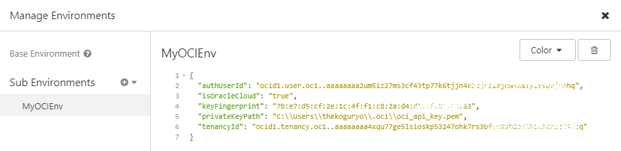

# insomnia-plugin-oci-request-signature

Provides custom request hook plugin to call OCI REST API with OCI request signature

[About OCI(Oracle Cloud Infrastructure) Request Signatures](https://docs.cloud.oracle.com/iaas/Content/API/Concepts/signingrequests.htm)

## Installation
1. Download plugin zip
https://github.com/TheKoguryo/insomnia-plugin-oci-request-signature/archive/master.zip

2. Extract zip file to Insomnia Plugins Folder
  * Insomnia > Application Menu > Preferences > Plugins Tab
  
  

  * Extract
  
  

3. Reload Plugin List

## Configuration

Set the following [environment variables within Insomnia](https://support.insomnia.rest/article/18-environment-variables):

1. <kbd>isOracleCloud</kbd>: if this is "true", call REST API with this oci-request-signature
2. <kbd>tenancyId</kbd>: Your tenancy's OCID
3. <kbd>authUserId</kbd>: Your user's OCID
4. <kbd>keyFingerprint</kbd>: The fingerprint of API Key
5. <kbd>privateKeyPath</kbd>: The private key path for API Key:Public Key

## Usage

Choose configured environment and then call your REST API.

